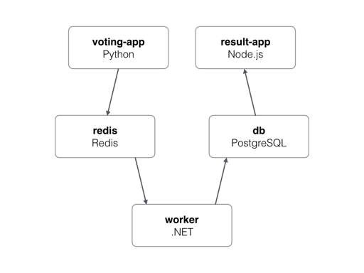

# Practices

## Run a Sample App in Kubernetes

### 1. Running Voting App in Kubernetes using Helm

Clone the repo below and navigate to folder 1.

```bash
git clone https://github.com/gokhansengun/troubleshooting-k8s.git
```

#### Voting App Architecture



You will find a `docker-compose.yml` file in folder root. Investigate this file and README.md file of the repo to know the app better.

Optional: Build and run the app using `docker-compose up` and navigate to `http://<ip>:5000` and `http://<ip>:5001` to access the app's web apps.

#### End Result

- You are expected to finish it within 120 minutes
- Run the apps in Kubernetes
- Use Helm the deploy apps (vote, result, worker) in Kubernetes
- Use ingress to access the web apps.
  - `http://result.cluster-<cluster_id>.do.gokhansengun.com` should point the result web app
  - `http://vote.cluster-<cluster_id>.do.gokhansengun.com` should point the voting web app

#### Hints

- You can use the Helm chart placed under `voting/charts/app` to deploy the apps or you can create your own using `helm create chart-name`.
- You can use existing Redis (stable/redis) and Postgres (stable/postgresql) Helm charts to deploy them, deploy them as a single instance (not highly available)
- Do not try to persist Redis and Postgres' data. Let it be lost if restarted. It is OK for now.

## Problems

### 1. Fixing a Problem, Pod Is Pending

Trying to reach the page `demo.cluster-<your_cluster_id>.do.gokhansengun.com` produces a 503 error. Please find out and fix the problem.

#### Hints

- You are expected to finish it within 30 minutes
- There is only one error

### 2. Fixing a Problem

Trying to reach the page `demo.cluster-<your_cluster_id>.do.gokhansengun.com` produces a 503 error. Please find out and fix the problem.

#### Hints

- You are expected to finish it within 30 minutes
- There might be a missing configuration
- `gsengun/aspnetcoredemo` Docker image accepts traffic on port 80

### 3. Fixing a Problem

Trying to reach the page `demo.cluster-<your_cluster_id>.do.gokhansengun.com` produces a 503 error. Please find out and fix the problem.

#### Hints

- You are expected to finish it within 15 minutes
- There is only one error
- `gsengun/aspnetcoredemo` Docker image accepts traffic on port 80

### 4. Fixing Some Problems

Trying to reach the page `petclinic.cluster-<your_cluster_id>.do.gokhansengun.com` produces errors. Please find out and fix the problems.

#### Hints

- You are expected to finish it within 25 minutes
- There are more than one error
- `gsengun/petclinic` Docker image accepts traffic on port 8080
